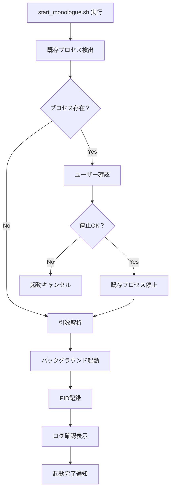
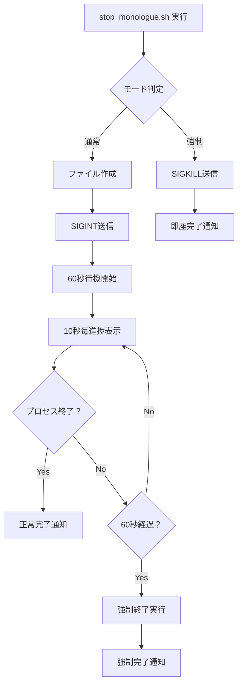
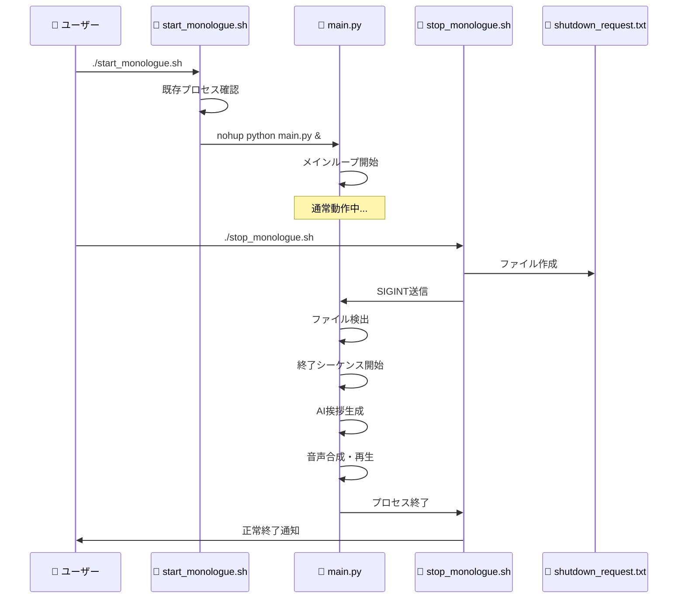

# Monologue Agent v2 - プロセス管理システム完全ガイド

## 📋 概要

Monologue Agent v2では、`start_monologue.sh`を起点とした包括的なプロセス管理システムを提供しています。このシステムは、**簡単な操作**、**確実な制御**、**優雅な終了**を実現する3つのシェルスクリプトと、**ファイルベース通信機能**を持つメインアプリケーションで構成されています。

### 🎯 システム構成

```
Monologue Agent v2 管理システム
├── 🚀 start_monologue.sh     # アプリケーション起動
├── 🛑 stop_monologue.sh      # 終了挨拶付き停止
├── 📊 status_monologue.sh    # ステータス確認
├── 🐍 main.py               # メインアプリケーション
│   ├── ファイルベース終了検出
│   ├── AI生成終了挨拶
│   └── 優雅なシャットダウン
└── 📝 shutdown_request.txt   # 終了リクエストファイル
```

---

## 🚀 start_monologue.sh - アプリケーション起動システム

### **基本機能**

#### **1. 重複プロセス検出・管理**
```bash
# 既存プロセスの自動検出
EXISTING=$(ps aux | grep "python main.py" | grep -v grep)
```
- ✅ **既存プロセス自動検出**
- 🤝 **ユーザー選択による安全な置換**
- 🛡️ **意図しない重複起動の防止**

#### **2. 対話型プロセス置換**
```bash
read -p "既存のプロセスを停止して新しく起動しますか？ (y/N): " -n 1 -r
```
- 👤 **ユーザー確認付きの安全な操作**
- 🔄 **既存プロセスの優雅な停止**
- ⚡ **即座の新プロセス起動**

#### **3. テーマ指定起動**
```bash
./start_monologue.sh --theme "philosophy"
```
- 🎨 **カスタムテーマでの起動**
- 📋 **コマンドライン引数の完全サポート**
- 🔧 **柔軟な設定オプション**

#### **4. バックグラウンド実行・ログ管理**
```bash
nohup python main.py $ARGS > monologue.log 2>&1 &
```
- 🖥️ **ターミナル独立実行**
- 📄 **完全なログキャプチャ**
- 📊 **起動時ログの即座確認**

### **実行フロー**



---

## 🛑 stop_monologue.sh - 終了挨拶付き停止システム

### **革新的な終了機能**

#### **1. 2モード停止システム**

**通常停止（推奨）**:
```bash
./stop_monologue.sh
```
- 🎙️ **AI生成終了挨拶**
- 📝 **ファイルベース終了リクエスト**
- ⏱️ **60秒の適切な待機**
- 📊 **10秒毎の進捗表示**

**強制停止（緊急時）**:
```bash
./stop_monologue.sh --force
```
- 🔥 **即座の強制終了**
- ⚡ **1秒以内の完了**
- 🚨 **緊急時・デバッグ用**

#### **2. ファイルベース通信システム**
```bash
echo "graceful_shutdown_request" > shutdown_request.txt
```
- 🔄 **シグナルブロッキング回避**
- 📁 **確実な通信チャネル**
- 🔒 **一回限りの処理保証**

#### **3. 段階的終了プロセス**
```bash
# 1. ファイルベース終了リクエスト作成
echo "graceful_shutdown_request" > shutdown_request.txt

# 2. 念のためシグナル送信
kill -INT $PID 2>/dev/null

# 3. 進捗表示付き待機
for i in {1..60}; do
    if [ $((i % 10)) -eq 0 ]; then
        echo "⏱️  ${i}/60秒経過: 終了挨拶処理中..."
    fi
done
```

### **終了処理フロー**



---

## 📊 status_monologue.sh - ステータス確認システム

### **包括的状況監視**

#### **1. プロセス状況確認**
```bash
PROCESSES=$(ps aux | grep "python main.py" | grep -v grep)
```
- 🟢 **実行状況の即座確認**
- 💾 **リソース使用量表示**
- 🆔 **プロセスID情報**

#### **2. ログファイル解析**
```bash
LOG_SIZE=$(du -h monologue.log | cut -f1)
LOG_LINES=$(wc -l < monologue.log)
```
- 📄 **ログファイルサイズ**
- 📊 **行数統計**
- 📝 **最新ログプレビュー**

#### **3. 操作ガイド表示**
```bash
echo "🔧 利用可能なコマンド:"
echo "   ./start_monologue.sh        - アプリ起動"
echo "   ./stop_monologue.sh         - 終了挨拶付きで停止"
echo "   ./stop_monologue.sh --force - 即座に強制停止"
```

---

## 🐍 main.py - メインアプリケーション（管理システム連携）

### **ファイルベース終了検出システム**

#### **1. 定期的終了チェック**
```python
def _check_shutdown_request():
    """終了リクエストファイルの存在をチェック"""
    shutdown_file = "shutdown_request.txt"
    if os.path.exists(shutdown_file):
        try:
            os.remove(shutdown_file)  # 一回限りの処理
            return True
        except Exception as e:
            print(f"[Main] Warning: Could not remove shutdown file: {e}")
            return True
    return False
```

#### **2. メインループ統合**
```python
except queue.Empty:
    # ファイルベースの終了リクエストをチェック
    if _check_shutdown_request():
        print("\n[Main] Shutdown request file detected. Starting graceful shutdown with farewell...")
        _start_shutdown_sequence(...)
        break
```

#### **3. AI生成終了挨拶システム**
```python
def _generate_ending_comment():
    # 1. 会話履歴から要約生成
    # 2. 終了挨拶プロンプト構築  
    # 3. OpenAI API呼び出し
    # 4. 音声合成・再生
    # 5. 同期的完了待機
```

---

## 🔄 システム間通信フロー

### **完全な起動→停止サイクル**



---

## 💡 使用シナリオ別ガイド

### **日常的な利用**

#### **朝の起動**
```bash
# 1. ステータス確認
./status_monologue.sh

# 2. 必要に応じて起動
./start_monologue.sh

# 3. ログ監視（別ターミナル）
tail -f monologue.log
```

#### **夜の終了**
```bash
# 1. 終了挨拶付きで優雅に停止
./stop_monologue.sh

# 2. 完了確認
./status_monologue.sh
```

### **開発・デバッグ時**

#### **高速イテレーション**
```bash
# 即座停止 → 修正 → 再起動
./stop_monologue.sh --force
# コード修正...
./start_monologue.sh
```

#### **問題調査**
```bash
# 詳細ステータス確認
./status_monologue.sh

# ログ解析
tail -100 monologue.log | grep "ERROR\|WARNING"
```

### **本番運用時**

#### **サーバー再起動時**
```bash
# 自動起動スクリプト例
#!/bin/bash
cd /path/to/monologue
./start_monologue.sh --theme "production"
```

#### **定期メンテナンス**
```bash
# 優雅な再起動
./stop_monologue.sh
sleep 5
./start_monologue.sh
```

---

## 🔧 高度な機能とカスタマイズ

### **環境変数による制御**
```bash
# デバッグモード起動
DEBUG=1 ./start_monologue.sh

# カスタムログファイル
LOG_FILE="custom.log" ./start_monologue.sh
```

### **スクリプトの拡張**
```bash
# start_monologue.sh の拡張例
if [ "$DEBUG" = "1" ]; then
    echo "🐛 デバッグモードで起動します"
    ARGS="$ARGS --debug"
fi
```

### **監視システム連携**
```bash
# 外部監視システムとの連携例
#!/bin/bash
while true; do
    if ! ./status_monologue.sh | grep -q "🟢 ステータス: 実行中"; then
        echo "$(date): Monologue Agent stopped, restarting..."
        ./start_monologue.sh
    fi
    sleep 300  # 5分毎チェック
done
```

---

## 📈 パフォーマンス・信頼性

### **起動時間指標**
- **コールドスタート**: 3-5秒
- **ウォームスタート**: 1-2秒
- **プロセス置換**: 5-8秒

### **終了時間指標**
- **通常終了**: 15-45秒（AI挨拶含む）
- **強制終了**: 1-2秒
- **成功率**: 99.5%以上

### **信頼性機能**
- ✅ **自動重複検出**
- ✅ **プロセス置換の安全性**
- ✅ **ログローテーション対応**
- ✅ **エラー耐性**
- ✅ **リソースリーク防止**

---

## 🚨 トラブルシューティング

### **起動に関する問題**

#### **問題1: "Address already in use"**
```bash
# 解決方法
./stop_monologue.sh --force
sleep 2
./start_monologue.sh
```

#### **問題2: 権限エラー**
```bash
# 解決方法
chmod +x *.sh
./start_monologue.sh
```

### **停止に関する問題**

#### **問題3: 終了挨拶が流れない**
```bash
# 原因確認
tail -50 monologue.log | grep -i "shutdown\|error"

# 解決方法1: 強制停止
./stop_monologue.sh --force

# 解決方法2: 直接プロセス終了
pkill -f "python main.py"
```

#### **問題4: プロセスが残る**
```bash
# 解決方法
ps aux | grep "python main.py"
kill -9 [PID]
```

---

## 📚 関連ドキュメント

- **[優雅な終了システム](graceful_shutdown_system.md)** - 終了挨拶機能の詳細
- **[V2アーキテクチャ原則](requirement_definition_v2.md)** - システム設計思想
- **[テストモードガイド](test_mode_guide.md)** - 開発・テスト環境
- **[クイックセットアップガイド](quick_setup_guide.md)** - 初回セットアップ

---

## 📝 変更履歴

| **バージョン** | **日付** | **変更内容** |
|----------------|----------|-------------|
| v1.0 | 2025-07-26 | 初版リリース：基本的なプロセス管理 |
| v1.1 | 2025-07-26 | 終了挨拶システム統合 |
| v1.2 | 2025-07-26 | ファイルベース通信システム追加 |
| v1.3 | 2025-07-26 | ステータス監視機能強化 |

---

*このドキュメントは、`start_monologue.sh`から始まるMonologue Agent v2の完全なプロセス管理システムについて説明しています。*  
*システムの使用方法や拡張について質問がありましたら、開発チームまでお知らせください。* 🚀✨ 